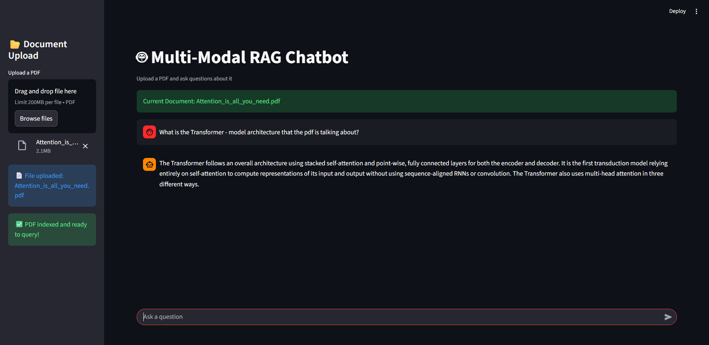

# Multi-Modal-RAG-Chatbot




A Multi-Modal Retrieval-Augmented Generation (RAG) system that allows users to upload PDF documents and ask questions grounded strictly in the document content.
The system supports text, tables, and OCR-based extraction, combines semantic search with FAISS, and generates accurate, citation-aware answers using Gemini 2.5 Flash.

## 🚀 Key Features

#### 📄 PDF Upload & Ingestion

Parses text, titles, lists, and tables

OCR fallback for scanned or image-based content

#### 🧠 Semantic Search

Vector embeddings stored in FAISS

Retrieves contextually relevant chunks

#### 🤖 LLM-Powered QA

Uses Google Gemini 2.5 Flash

Answers strictly from retrieved context

#### 📌 Source Attribution

Page-level citations included in responses

#### 💻 Interactive UI

Streamlit-based chat interface

Real-time indexing & querying

## 🏗️ System Architecture
**Pipeline Flow:**

- PDF Upload  
- Unstructured.io Parsing  
- Normalized Multi-Modal Chunks  
- Vector Embeddings  
- FAISS Index  
- Semantic Retrieval  
- Gemini LLM  
- Grounded Answer + Citations  


## 📁 Project Structure

```text
.
├── app.py                  # Streamlit UI
├── build_index.py          # PDF ingestion & FAISS indexing
├── multi_modal_ingest.py   # PDF parsing & normalization
├── ocr_utils.py            # OCR helpers (Tesseract)
├── vector_store.py         # FAISS build/load utilities
├── retriever.py            # Semantic retrieval logic
├── qa_engine.py            # RAG + Gemini answer generation
├── requirements.txt        # Project dependencies
├── README.md               # Project documentation
└── assets/
    └── ui.png              # UI screenshot

```
## ⚙️ Installation & Setup
1️⃣ Clone the Repository
git clone https://github.com/your-username/multi-modal-rag-chatbot.git
cd multi-modal-rag-chatbot

2️⃣ Create Virtual Environment
python -m venv venv
source venv/bin/activate  # Windows: venv\Scripts\activate

3️⃣ Install Dependencies
pip install -r requirements.txt

4️⃣ Set Environment Variables

Create a .env file:

GOOGLE_API_KEY=your_gemini_api_key

▶️ Running the Application
Build Vector Index
python build_index.py

Start the UI
streamlit run app.py


Then upload a PDF and start asking questions.

## 🧪 Example Questions

What are the deliverables mentioned in this document?

Explain the Transformer architecture described in the paper.

What evaluation criteria are used?

## 📊 Design Choices & Observations

Unstructured.io was chosen for robust PDF parsing and table extraction

FAISS enables fast, local semantic retrieval

OCR fallback ensures support for scanned documents

The system is document-bounded, reducing hallucinations

Modular design allows easy extension to images, charts, or multi-PDF support
